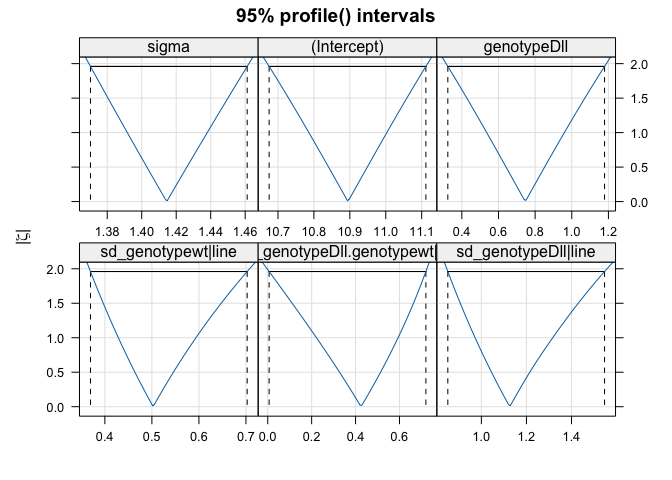

# Using the parametric bootstrap (Monte Carlo simulations) for inferences with mixed models


## libraries

```r
library(lme4)
```

```
## Loading required package: Matrix
```

```r
library(glmmTMB)
```

```
## Warning in checkDepPackageVersion(dep_pkg = "TMB"): Package version inconsistency detected.
## glmmTMB was built with TMB version 1.9.6
## Current TMB version is 1.9.10
## Please re-install glmmTMB from source or restore original 'TMB' package (see '?reinstalling' for more information)
```

```r
library(pbkrtest)
library(MuMIn)
library(car)
```

```
## Loading required package: carData
```

```r
library(r2glmm) # mixed model r^2 etc..
library(lattice)
library(corrplot)
```

```
## corrplot 0.92 loaded
```


## read in data, and prep it.

```r
sct_data  <- read.csv("https://raw.githubusercontent.com/DworkinLab/DworkinLab.github.io/master/dataSets/Dworkin2005_ED/dll.csv", 
                    header=TRUE,
                    stringsAsFactors = TRUE)

sct_data <- na.omit(sct_data)

sct_data$temp <- as.factor(sct_data$temp)
sct_data$replicate <- factor(sct_data$replicate)

sct_data$tarsus.centered <- scale(sct_data$tarsus, 
                                  center = T, scale = T) 

sct_data$genotype <- relevel(sct_data$genotype, "wt")
```


## Let's get a sense of the question we are thinking about

- These values will only give us a rough idea, but provides a ballpark for the estimates.


```r
SCT_strain_means <- with(sct_data,
                         tapply(SCT, list(line, genotype), mean))

plot(SCT_strain_means, 
     col = "red", pch = 20, cex = 2,
     xlim = c(9.5,15), ylim = c(9.5, 15), 
     main = "average SCT number by strain, across two genotypes")

abline(a = 0, b = 1, lty = 2, col = rgb(0,0,1, 0.25))
```

<!-- -->

```r
cor(SCT_strain_means) # correlation among strain means across the two genotypes
```

```
##         wt    Dll
## wt  1.0000 0.3552
## Dll 0.3552 1.0000
```

```r
apply(SCT_strain_means, 2, sd) # among strain standard deviation for SCT for the two genotypes
```

```
##     wt    Dll 
## 0.5544 1.2651
```


## Let's model this formally in a mixed model

- note I am using `(0 + genotype | line)` notation for the random effect as I interested in the variances of the random effects themselves, not expressed as a treatment contrast (like we have for the fixed effects).


```r
model_1_REML_us <- lmer(SCT ~ 1 +  genotype + (0 + genotype | line), 
                      data = sct_data) # NOTE: REML = TRUE by default
```


```r
summary(model_1_REML_us)
```

```
## Linear mixed model fit by REML ['lmerMod']
## Formula: SCT ~ 1 + genotype + (0 + genotype | line)
##    Data: sct_data
## 
## REML criterion at convergence: 6899
## 
## Scaled residuals: 
##    Min     1Q Median     3Q    Max 
## -3.608 -0.661 -0.011  0.634  6.086 
## 
## Random effects:
##  Groups   Name        Variance Std.Dev. Corr
##  line     genotypewt  0.264    0.514        
##           genotypeDll 1.325    1.151    0.42
##  Residual             2.001    1.414        
## Number of obs: 1918, groups:  line, 27
## 
## Fixed effects:
##             Estimate Std. Error t value
## (Intercept)   10.894      0.109    99.6
## genotypeDll    0.748      0.214     3.5
## 
## Correlation of Fixed Effects:
##             (Intr)
## genotypeDll -0.116
```

```r
VarCorr(model_1_REML_us)
```

```
##  Groups   Name        Std.Dev. Corr
##  line     genotypewt  0.514        
##           genotypeDll 1.151    0.42
##  Residual             1.414
```


Let's examine the conditional means (the "strain" means), by genotype


```r
plot(ranef(model_1_REML_us), 
     pch = 20, col = "blue", cex = 2,
     main = "conditional means")
```

```
## $line
```

<!-- -->

##  confidence intervals via profiling the likelihood surface


```r
model1_ML_profile <- profile(model_1_REML_us, signames = FALSE) # profile the likelihood surface

confint(model1_ML_profile) # For more complicated models this may not work. So you may need to use parametric or non-parametric bootstrap in particular for the variances.
```

```
##                                     2.5 %  97.5 %
## sd_genotypewt|line               0.369384  0.7027
## cor_genotypeDll.genotypewt|line  0.006372  0.7202
## sd_genotypeDll|line              0.851045  1.5468
## sigma                            1.370270  1.4612
## (Intercept)                     10.675402 11.1116
## genotypeDll                      0.323554  1.1789
```

```r
# .sig01 corresponds to the StDDev for the random intercept (among strain variance for SCT number for wild type)
# .sig02 corresponds to the StDDev for the among strain correlation across the two genotypes
# .sig03 corresponds to the StDDev for the genotypeDll
# .sigma is the residual standard deviation
```

## plotting to get a sense of the confidence intervals


```r
lattice::xyplot(model1_ML_profile, absVal = TRUE, conf = c(0.95),
       main = "95% profile() intervals", lty = 2)
```

<!-- -->


```r
lattice::densityplot(model1_ML_profile, upper = 0.975)
```

<!-- -->

## Percent variance accounted for

A bit tricky in mixed, models, but there are some approaches to it.

MUMin marginal (fixed) and condition (fixed + random R2 measures for model)

```r
r.squaredGLMM(model_1_REML_us)
```

```
## Warning: 'r.squaredGLMM' now calculates a revised statistic. See the help page.
```

```
##          R2m    R2c
## [1,] 0.04805 0.3023
```

```r
r2beta(model_1_REML_us)
```

```
##        Effect   Rsq upper.CL lower.CL
## 1       Model 0.058     0.08     0.04
## 2 genotypeDll 0.058     0.08     0.04
```


## degrees of freedom in mixed models is not simple!
Keep in mind that "counting" parameters for random effects is difficult and may be done differently by different programs


```r
-2*logLik(model_1_REML_us)
```

```
## 'log Lik.' 6899 (df=6)
```

## Model "testing


Generally they only assess fit of fixed effect terms (conditioned on the random terms), but do not assess differences in models that differ for random effects.  I think the library `afex` has some related functionality.

```r
car::Anova(model_1_REML_us)
```

```
## Analysis of Deviance Table (Type II Wald chisquare tests)
## 
## Response: SCT
##          Chisq Df Pr(>Chisq)
## genotype  12.2  1    0.00047
```


### testing variance components
If for whatever reason the confidence intervals on the variance components are not enough, you can use some approaches based on ideas from a likelihood ratio (LR) to compare models with and without a particular random effect (make sure REML = TRUE).  As we discussed in class, most of the time the LR in the context of a likelihood ratio test (LRT), i.e. comparing the LR in the context of a $\chi^2$ distribution is not the way to go. Most often we will use either permutation tests or a parametric bootstrap.

Counting the number of parameters for random effects can be difficult if the data is not balanced. Therefore it is best to use "test statistics" which will not depend on knowing the number of random effect parameters being estimated (as a df). So commonly you will see (and this is what pbkrtest does) a likelihood ratio, but evaluated using parametric bootstrap, permutation or non-parametric bootstrap (the latter two take some seriously thinking about the resampling procedure).


I have not used `pbkrtest` library much, and generally write my own parametric bootstrap simulator either like we did in class, or using simulate(yourMerModel). `simulate()` is a generic function that calls class specific methods, in this case (for `lmer`) `simulate.merMod`.


```r
logLik(model_1_REML_us)
```

```
## 'log Lik.' -3449 (df=6)
```

```r
REMLcrit(model_1_REML_us) # the deviance, i.e. $2 X L$
```

```
## [1] 6899
```

### reduced model

If we wanted to compare to the simpler model without the "random slope" for genotypic effects (and also the correlation between random slope and intercept in this case) we could fit the following model.


```r
model_reduced_REML <- lmer(SCT ~ 1 + genotype + (1| line), 
                      data = sct_data) 

logLik(model_reduced_REML)
```

```
## 'log Lik.' -3511 (df=4)
```


How do we compare?  We can compute the Likelihood Ratio (LR) between models (below)...
 

```r
LR_model <-  -as.numeric(REMLcrit(model_1_REML_us) - REMLcrit(model_reduced_REML))

LR_model
```

```
## [1] 123.1
```

### A pure Likelihood ratio test (LRT) can get you in trouble

The question now becomes how many df these two models differ by. We are estimating 2 less terms for the random effects (the random "slope" for the genotypic effect, and covariance between the random slope and the random intercept). So one approach would be to compare this to a $\chi^2$ distribution with 2 df.


```r
pchisq(q = LR_model, df = 2, lower = F) 
```

```
## [1] 1.902e-27
```

Which is very similar to as the default anova method (although this refits under ML not REML).


```r
anova(model_1_REML_us, model_reduced_REML)
```

```
## refitting model(s) with ML (instead of REML)
```

```
## Data: sct_data
## Models:
## model_reduced_REML: SCT ~ 1 + genotype + (1 | line)
## model_1_REML_us: SCT ~ 1 + genotype + (0 + genotype | line)
##                    npar  AIC  BIC logLik deviance Chisq Df Pr(>Chisq)
## model_reduced_REML    4 7024 7046  -3508     7016                    
## model_1_REML_us       6 6907 6940  -3447     6895   121  2     <2e-16
```

However, as a reminder, we previously discussed issues with LRT near boundary conditions (in this case a variance of 0), and whether this approach is at all appropriate. 

We also have the issues about degrees of freedom. What do I mean? Instead of thinking about the the 2 additional parameters for the random effects (the random slope and covariance between it and the random intercept), we could instead frame this around the 27 additional "conditional means"/BLUPs we are computing. So how do we know which (if either) we should use? There are approaches that try to deal with this issue (estimating the df), but we have better tools at our disposal that allow us to not have to worry about this issue.

So even putting aside the issues with the LRT for a boundary condition (a variance of 0), do we use the LRT with the above df, or the following?


```r
pchisq(q = LR_model, df = 27, lower = F) 
```

```
## [1] 3.205e-14
```

 you can see by the massive change in the magnitude of the p-value.  Best to rely on the parametric bootstrap! It does not require information about degrees of freedom or making assumptions necessary for the LRT based on $\chi^2$


Remember that the model we are using for the simulation is the reduced model, even though we refit (with the simulated data) under both the full and reduced models!


```r
LikRatioSim <- function(mod = model_reduced_REML) {
	y_sim <- simulate(mod, nsim = 1)  # one set of simulated data under reduced model
	model_lower <- lmer(y_sim$sim_1 ~ 1 + genotype + (1|line), data = sct_data) # fit simulated data under reduced model
	
	model_full  <- lmer(y_sim$sim_1 ~ 1 + genotype + (0 + genotype|line), data = sct_data) # fit simulated data w complex model 
	
	LRSim <-  -as.numeric(REMLcrit(model_full) - REMLcrit(model_lower)) # Likelihood Ratio
	return(LRSim)
}
```

Test that it works (should spit out one number for each run, and the numbers should be different each time)

```r
LikRatioSim()
```

```
## [1] 0.3442
```

```r
LikRatioSim()
```

```
## [1] 0.18
```

```r
LikRatioSim()
```

```
## [1] 2.675
```


```r
n_sim = 500 # 500 simulations (possibly not enough simulations, but for time...)

LikRatParBoot <- replicate(n = n_sim, LikRatioSim())
```

```
## Warning in checkConv(attr(opt, "derivs"), opt$par, ctrl = control$checkConv, :
## Model failed to converge with max|grad| = 0.00317724 (tol = 0.002, component 1)
```

```
## Warning in checkConv(attr(opt, "derivs"), opt$par, ctrl = control$checkConv, :
## Model failed to converge with max|grad| = 0.00218594 (tol = 0.002, component 1)
```

```
## Warning in checkConv(attr(opt, "derivs"), opt$par, ctrl = control$checkConv, :
## Model failed to converge with max|grad| = 0.00298175 (tol = 0.002, component 1)
```

```
## Warning in checkConv(attr(opt, "derivs"), opt$par, ctrl = control$checkConv, :
## Model failed to converge with max|grad| = 0.00209128 (tol = 0.002, component 1)
```

```
## Warning in checkConv(attr(opt, "derivs"), opt$par, ctrl = control$checkConv, :
## Model failed to converge with max|grad| = 0.00201567 (tol = 0.002, component 1)
```

```
## Warning in checkConv(attr(opt, "derivs"), opt$par, ctrl = control$checkConv, :
## Model failed to converge with max|grad| = 0.00571043 (tol = 0.002, component 1)
```

```
## Warning in checkConv(attr(opt, "derivs"), opt$par, ctrl = control$checkConv, :
## Model failed to converge with max|grad| = 0.00220771 (tol = 0.002, component 1)
```

```
## Warning in checkConv(attr(opt, "derivs"), opt$par, ctrl = control$checkConv, :
## Model failed to converge with max|grad| = 0.00201675 (tol = 0.002, component 1)
```

```
## Warning in checkConv(attr(opt, "derivs"), opt$par, ctrl = control$checkConv, :
## unable to evaluate scaled gradient
```

```
## Warning in checkConv(attr(opt, "derivs"), opt$par, ctrl = control$checkConv, :
## Model failed to converge: degenerate Hessian with 1 negative eigenvalues
```

```
## Warning in checkConv(attr(opt, "derivs"), opt$par, ctrl = control$checkConv, :
## Model failed to converge with max|grad| = 0.00299377 (tol = 0.002, component 1)
```

Ignore the `boundary (singular) fit: see help('isSingular')` for the moment.

Our distribution of LR values under the parametric bootstrap (simulations of data under the reduced model)

```r
hist(LikRatParBoot, 
     breaks = 30, main = NULL,
     xlab = "Likelihood ratio from parametric bootstrap")
```

<!-- -->

Let's do this again, but adding our likelihood ratio of the two models from the observed data

```r
hist(LikRatParBoot, 
     breaks = 30, xlim = c(0, 135), main = NULL,
     xlab = "Likelihood ratio from parametric bootstrap")

abline(v = LR_model, col = "red", lty = 2)
```

<!-- -->

And we can calculate the p-value (up to the limits of the number, n_sim we performed) as follows

```r
(length(LikRatParBoot[LikRatParBoot >= LR_model]) + 1)/n_sim
```

```
## [1] 0.002
```

The parametric bootstrap makes very strong assumptions, so do evaluate whether this assumptions will be problematic with your data and model.


## Note on using REML vs ML (Resticted Maximum Likelihood vs Maximum Likelihood)

- If you are comparing models that only differ in random effects, use `REML = TRUE`

- If you are comparing models that only differ in fixed effects, use `REML = FALSE` (i.e you are using regular maximum likelihood)

- If you are comparing models that differ in both, use `REML = FALSE`. The variance components for the random effects will be biased, but at least fixed effects will be be interpretable!


## pbkrtest library can automate the tasks

- clean syntax, and pretty fast!


```r
PB_bootie <- PBmodcomp(largeModel = model_1_REML_us, 
                       smallModel = model_reduced_REML, 
                       nsim = 999, cl = 4) # set cl for number of clusters/cores

PB_bootie$test["PBtest",] # extract the parametric bootstrap 
```

```
##         stat df  p.value
## PBtest 121.1 NA 0.001003
```


## Using the parametric bootstrap instead of profiling to get confidence intervals on your estimates

For some complex models you will find that profiling of the likelihood surface can run into roadblocks and fail.

While the use of the parametric bootstrap makes strong assumptions regarding distributions the data is coming from, if all else fails, it is a reasonable alternative. 
(Ian personal note, I would use a fully Bayesian approach, with somewhat regularizing priors, or a hierarchical, non-parametric bootstrap (with strata) preferentially, but the PB is an alternative).


**NOTE: WE ARE NOW ONLY SIMULATING UNDER THE FULL MODEL, BASED ON THE FULL MODEL**

The easy way (thanks Ben!). In lme4 there is a `confint.merMod`. We used this above as the default is to use ML profiles, but it can use a NP-bootstrap as well.


```r
PB_CIs <- confint(model_1_REML_us, level = 0.95, 
                   method = "boot", boot.type = "perc", nsim = 1000)
```

```
## Computing bootstrap confidence intervals ...
```

```
## 
## 4 warning(s): Model failed to converge with max|grad| = 0.00211963 (tol = 0.002, component 1) (and others)
```

```r
PB_CIs
```

```
##                 2.5 %  97.5 %
## .sig01       0.339930  0.6832
## .sig02       0.002503  0.7621
## .sig03       0.814605  1.5049
## .sigma       1.367939  1.4590
## (Intercept) 10.673154 11.1104
## genotypeDll  0.363531  1.1700
```


I assume under the hood it is doing something like (using `bootMer` via `simulate.merMod` perhaps?)


```r
pull_out_estimates <- function(.) {
                         c(beta = fixef(.), 
                           sigma = sigma(.), 
                           sig01 = (unlist(VarCorr(.))))} 
              # as variances and correlations I think. Double check with BB.


PB_boot_full_model <- bootMer(model_1_REML_us,
                              FUN = pull_out_estimates,
                              nsim = 1000,
                              use.u = FALSE,
                              type = "parametric")


PB_boot_full_model
```

```
## 
## PARAMETRIC BOOTSTRAP
## 
## 
## Call:
## bootMer(x = model_1_REML_us, FUN = pull_out_estimates, nsim = 1000, 
##     use.u = FALSE, type = "parametric")
## 
## 
## Bootstrap Statistics :
##     original     bias    std. error
## t1*  10.8944  0.0016251     0.10363
## t2*   0.7479  0.0016869     0.22116
## t3*   1.4145  0.0006017     0.02356
## t4*   0.2641 -0.0003755     0.09120
## t5*   0.2493 -0.0031509     0.14224
## t6*   0.2493 -0.0031509     0.14224
## t7*   1.3250  0.0081653     0.39251
```

```
## 
## 2 warning(s): Model failed to converge with max|grad| = 0.00281939 (tol = 0.002, component 1) (and others)
```

```r
confint(PB_boot_full_model, type = "perc")
```

```
##                      2.5 % 97.5 %
## beta.(Intercept) 10.678985 11.099
## beta.genotypeDll  0.313670  1.187
## sigma             1.369492  1.464
## sig01.line1       0.111970  0.451
## sig01.line2       0.002387  0.558
## sig01.line3       0.002387  0.558
## sig01.line4       0.632645  2.193
```


For more information take a look at `?confint.bootMer` and `?bootMer`.


We could also re-write the function to do so ourselves (but instead of fitting both reduced and full model, we just do the full model). However, these helper functions, are well... helpful!!!!


### Other stuff

For PB based LRT and other inferential approaches see also RLRsim, pbkrtest, lmerTest, arm::se.ranef()
Other useful libraries, r2glmm, r2beta.
robust lmm is also worth looking into.


```r
sessionInfo()
```

```
## R version 4.3.2 (2023-10-31)
## Platform: x86_64-apple-darwin20 (64-bit)
## Running under: macOS Sonoma 14.3.1
## 
## Matrix products: default
## BLAS:   /Library/Frameworks/R.framework/Versions/4.3-x86_64/Resources/lib/libRblas.0.dylib 
## LAPACK: /Library/Frameworks/R.framework/Versions/4.3-x86_64/Resources/lib/libRlapack.dylib;  LAPACK version 3.11.0
## 
## locale:
## [1] en_US.UTF-8/en_US.UTF-8/en_US.UTF-8/C/en_US.UTF-8/en_US.UTF-8
## 
## time zone: America/Toronto
## tzcode source: internal
## 
## attached base packages:
## [1] stats     graphics  grDevices utils     datasets  methods   base     
## 
## other attached packages:
##  [1] corrplot_0.92  lattice_0.22-5 r2glmm_0.1.2   car_3.1-2      carData_3.0-5 
##  [6] MuMIn_1.47.5   pbkrtest_0.5.2 glmmTMB_1.1.8  lme4_1.1-35.1  Matrix_1.6-5  
## 
## loaded via a namespace (and not attached):
##  [1] sass_0.4.8          utf8_1.2.4          generics_0.1.3     
##  [4] tidyr_1.3.1         digest_0.6.35       magrittr_2.0.3     
##  [7] evaluate_0.23       grid_4.3.2          estimability_1.5   
## [10] mvtnorm_1.2-4       fastmap_1.1.1       jsonlite_1.8.8     
## [13] backports_1.4.1     mgcv_1.9-1          purrr_1.0.2        
## [16] fansi_1.0.6         numDeriv_2016.8-1.1 jquerylib_0.1.4    
## [19] abind_1.4-5         cli_3.6.2           rlang_1.1.3        
## [22] splines_4.3.2       cachem_1.0.8        yaml_2.3.8         
## [25] parallel_4.3.2      tools_4.3.2         nloptr_2.0.3       
## [28] coda_0.19-4.1       minqa_1.2.6         dplyr_1.1.4        
## [31] boot_1.3-30         broom_1.0.5         vctrs_0.6.5        
## [34] R6_2.5.1            stats4_4.3.2        lifecycle_1.0.4    
## [37] emmeans_1.10.0      MASS_7.3-60.0.1     pkgconfig_2.0.3    
## [40] bslib_0.6.1         pillar_1.9.0        glue_1.7.0         
## [43] Rcpp_1.0.12         highr_0.10          xfun_0.42          
## [46] tibble_3.2.1        tidyselect_1.2.1    rstudioapi_0.15.0  
## [49] knitr_1.45          xtable_1.8-4        htmltools_0.5.7    
## [52] nlme_3.1-164        rmarkdown_2.26      TMB_1.9.10         
## [55] compiler_4.3.2
```

