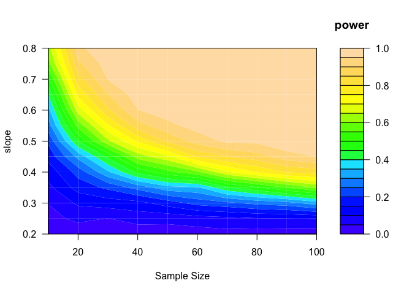
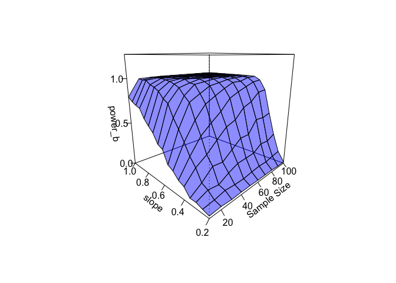
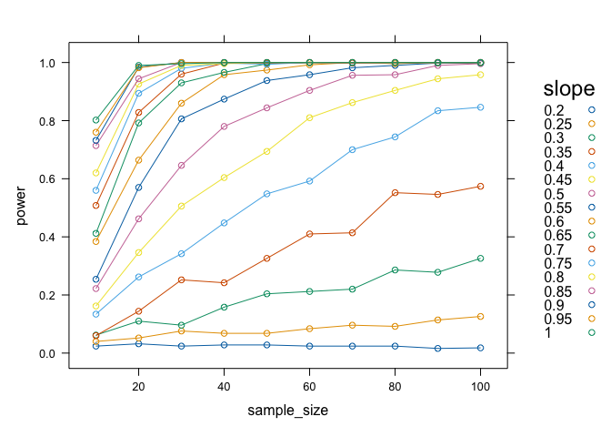

``` r
library(lattice)
```


## tools in `R`
>- Many libraries in `R` to use, depending on purposes.
>- in base `R`, there is `power.t.test()`, `power.anova.test()`, `power.prop.test()`
>- `pwr` is an `R` package that does many simple types of statistical models (proportions, 1-way ANOVA, regression, $\chi^2$, glm)
>- See the [CRAN TASK VIEWS on experimental design](https://cran.r-project.org/web/views/ExperimentalDesign.html) for a list (and description) of more.
>- See this [draft task view for power](https://github.com/statisfactions/ctv-power/blob/main/ctv-power.md)

## Sometimes you just need to do your own simulations though.

There are some packages which can help with this as well, such as [`simr`](https://cran.r-project.org/web/packages/simr/index.html) and [`simpr`](https://cran.r-project.org/web/packages/simpr/index.html) (the latter uses tidyverse verb syntax which can be helpful). 


## Monte carlo power analysis example

### using a for loop

``` r
N = 500  # Number of simulations for inner loop. You generally want this to be >1000. 

minimum_value = rep(NA, N) # initializing the vector to store the minimum value from your estimates
#Global Parameter values

minimum_threshold = 0.2 # The minimum value of interest

a = 0.5 # intercept

b <- seq(from = 0.2, to = 1, by = 0.05) # slope magnitudes to try

sample_size <- seq(from = 10, to = 100, by = 10)  # Incremently increasing sample size 

power_size <- numeric(length(sample_size)) # initializing the vector to store the "power" at each sample size for the outer for loop.

### initialize the matrix to store all of the "power" estimates
power_b <- matrix(NA, length(sample_size), length(b))
```

### Now the actual for loop

``` r
for (k in 1:length(b))  # across the different effect sizes
 {
  
  b_b <- b[k]
  
   for (j in 1:length(sample_size))  # looping through the different sample_sizes

    {
   
      s_s = sample_size[j]
      for (i in 1:N)
      {
       x <- rnorm(s_s, mean = 20, sd = 3)  # simulate values of predictor
       y_det <- a + b_b*x             # deterministic part of model
       y_sim <- rnorm(s_s, mean = y_det, sd = 2)  # Simulate y|x values
       lm1 <- lm(y_sim ~ x)                    # fit model given simulation 
       minimum_value[i] <- confint(lm1)[2,1] # You may want to extract a different value from the model. Lower bound of 95% CI
	  
     }
    
      power_size[j] <- length(minimum_value[minimum_value > minimum_threshold])/N   # How many estimates are greater than the relevant threshold
   }
   
    power_b[,k] <- power_size 
}
```


### Plotting results from a power analysis

``` r
par(mfrow = c(1,1))

filled.contour(z = power_b, x = sample_size, y = b, 
    ylim = c(min(b), max(b)), xlim = c(min(sample_size), max(sample_size)), 
    xlab = "Sample Size", ylab = "slope", color = topo.colors,
    key.title = title(main = "power"))
```

<!-- -->

### Plotting results from a power analysis

``` r
persp(y = b, x = sample_size, z = power_b, col = rgb(0, 0, 1, 0.45), theta = -45, 
    shade = 0.75, ltheta = 45, ylab = "slope", xlab = "Sample Size", 
    lphi = 30, zlim = c(0,1.25), ticktype = "detailed")
```

<!-- -->

### Plotting results from a power analysis


<!-- -->


