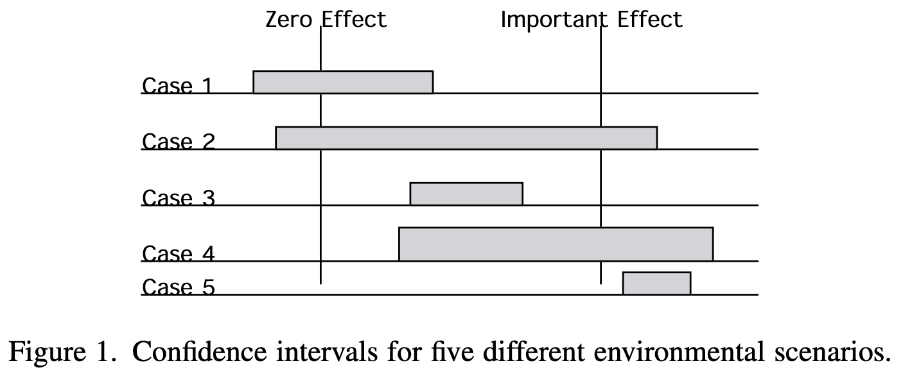
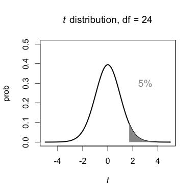
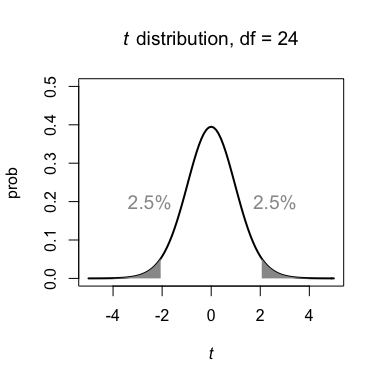
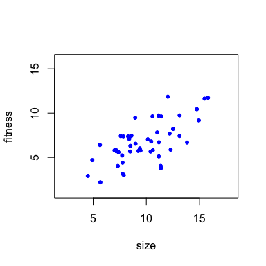
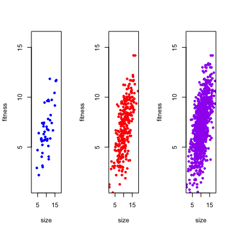
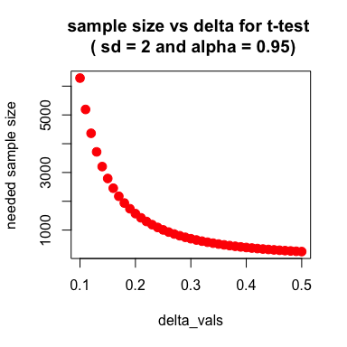

## points to think about before starting your power analysis



From Fox 2001 (DOI:10.1002/env.470)


## points to think about before starting your power analysis
* Power analysis to maximize precision of your quantities of interest

* [This paper by Daniël Lakens](https://online.ucpress.edu/collabra/article/8/1/33267/120491/Sample-Size-Justification) is a good starting place for considering how to determine sample sizes that will be sufficient for your needs.

## the traditional "4 possible outcomes of a statistical test" 

|          |Reject Null  | Accept Null
|----------|------------ |-------------
|Null True |Type I error, $\alpha$ | Correct, $1 - \alpha$
|Null False|Correct, $1 -\beta$  | Type II error, $\beta$

- $(1- \beta)$ is power, probability of detecting a true difference.

- $(1 -\alpha)$ is confidence, probability of correctly accepting null.


## Critical value for a $t$ distribution, for a one tailed test
<!-- -->

## Critical value for a $t$ distribution, for a two tailed test
<!-- -->

## Keep in mind

These kinds of dichotomies lead you to an *"Is there an effect?"* thinking.

Instead you should ask *"What is the effect?"* and for a power analysis, *"What precision of the effect do I want, given the resources I have?"*

## What does a p-value tell you?

>- Say you conduct an analysis on two different data sets, in the first p = 0.05, the second test has p = 0.001.
>- Does this mean the second test has a bigger effect? That the statistical model accounts for more variation (i.e. higher $R^2$)?
>- Not necessarily. The magnitude of an effect could be similar, and the sample sizes differ (the second data set being much larger).
>- It could also be that there is less variability in the second data set.
>- However it could also be that there is a difference in these. You need to examine (and report) all three whenever possible (include confidence intervals on estimates).


## Let's compare these three data sets
- We are examining the relationship between body size and fitness.

## Let's compare these three data sets


- Is there a relationship?
<!-- -->

## Is there a relationship?


<!-- -->

>- In fact they all have the same relationship $fitness \sim N(2 + 0.5*size, \sigma = 2)$, and only differ in sample size.

## Statistical Power Analysis in `R`

>- Most statistical software packages provide functions for simple power analyses
>- In `R` there are many libraries one can use


## Getting a critical value (for $t$ distribution)

>- Let's start by seeing how we get critical values for a $t$ distribution
>- Assume we have a sample size of $n = 25$, $\alpha = 0.05$ for a two-tailed distribution.
>- We can use the `qt()` function for the $t$ distribution

## Getting a critical value (for $t$ distribution)

- Let's start by seeing how we get critical values for a $t$ distribution
- Assume we have a sample size of $n = 25$, $\alpha = 0.05$ for a two-tailed distribution.
- We can use the `qt()` function for the $t$ distribution


```r
qt(p = 0.975, df = 24)
```

```
## [1] 2.06
```

>- Why do we have df = 24, not 25?
>- Why is p = 0.975, not 0.95 (with $\alpha = 0.05$)?

## How does the critical value change with sample size?

-  We can make a plot looking at this across a range of sample sizes.

## How does the critical value change with sample size?

-  We can make a plot looking at this across a range of sample sizes.


```r
curve(qt(p = 0.975,df = x), 2, 25, 
    col = "red", lwd = 3, cex.lab = 2,
    main = "Critical values of t for different sample sizes",
    xlab = "Sample Size", 
    ylab = expression(paste("t value (two tailed), ", alpha, " =0.05")))
```

## How does the critical value change with sample size?

-  We can make a plot looking at this across a range of sample sizes.

<!-- -->

## Critical values for other distributions
>- There are other distributions we can use: 
>- `qf()` for the $F$ distribution, `qchisq()` for $\chi^2$ etc..

## tools in `R`
>- Many libraries in `R` to use, depending on purposes.
>- in base `R`, there is `power.t.test()`, `power.anova.test()`, `power.prop.test()`
>- `pwr` is an `R` package that does many simple types of statistical models (proportions, 1-way ANOVA, regression, $\chi^2$, glm)
>- See the [CRAN TASK VIEWS on experimental design](https://cran.r-project.org/web/views/ExperimentalDesign.html) for a list (and description) of more.
>- See this [draft task view for power](https://github.com/statisfactions/ctv-power/blob/main/ctv-power.md)
>- I will show just a couple here.


## Some of the functions in base R


```
## [1] "power"            "power.anova.test" "power.prop.test"  "power.t.test"
```

## `power.t.test`
>- What goes into a $t$-test?

>- 
$$\frac{\bar{x}_A - \bar{x}_B }{ {\hat{\sigma}} \frac{1}{\sqrt{n} }}$$
>- $\bar{x}_A$ is the mean for group $A$, $\bar{x}_B$ for $B$
>- The denominator is just the *pooled standard error of the mean*
>- So we see that there are 4 critical things:
>- $\alpha$, the difference between means $\Delta = \bar{x}_A - \bar{x}_B$, $n$ and $\hat{\sigma}$


## `power.t.test`

```r
pwr_t_check <- power.t.test(delta = 0.5, sd = 2, 
                       sig.level = 0.05, power = 0.8)

pwr_t_check
```

```
## 
##      Two-sample t test power calculation 
## 
##               n = 252
##           delta = 0.5
##              sd = 2
##       sig.level = 0.05
##           power = 0.8
##     alternative = two.sided
## 
## NOTE: n is number in *each* group
```

```r
str(pwr_t_check)
```

```
## List of 8
##  $ n          : num 252
##  $ delta      : num 0.5
##  $ sd         : num 2
##  $ sig.level  : num 0.05
##  $ power      : num 0.8
##  $ alternative: chr "two.sided"
##  $ note       : chr "n is number in *each* group"
##  $ method     : chr "Two-sample t test power calculation"
##  - attr(*, "class")= chr "power.htest"
```

```r
pwr_t_check$n
```

```
## [1] 252
```


## `power.t.test`
>-  what sample sizes we would need for a range of differences, $\Delta = (0.1--0.5)$.
>- $(1 - \beta) = 0.8$, $\hat{\sigma} = 2$, $\alpha = 0.05$

## `power.t.test`
- $\Delta = 0.5$, $\hat{\sigma} = 2$, $\alpha = 0.05$


```r
delta_vals = seq(from = 0.1, to = 0.5, by = 0.01)
delta_vals
```

```
##  [1] 0.10 0.11 0.12 0.13 0.14 0.15 0.16 0.17 0.18 0.19 0.20 0.21 0.22 0.23 0.24
## [16] 0.25 0.26 0.27 0.28 0.29 0.30 0.31 0.32 0.33 0.34 0.35 0.36 0.37 0.38 0.39
## [31] 0.40 0.41 0.42 0.43 0.44 0.45 0.46 0.47 0.48 0.49 0.50
```

>- This creates a vector from 0.1 - 0.5

## `power.t.test`

```r
pow.test <- function(x){

  pow2 <- power.t.test(delta = x, sd = 2, 
                       sig.level = 0.05, power = 0.8) # We only allow delta to vary.

  	return(pow2$n) # This pulls out the sample size we need
	}
```

## `power.t.test`

```r
power.n <- sapply(delta_vals, pow.test)
```
>- This just uses one of the apply functions to repeat the function `pow.test` for each element of the vector "delta_vals". 
>- Thus for each value in the vector "delta_vals" (from 0.1 to 0.5), it inputs this value into `pow.test()` and then returns the estimated n (# of observations needed to achieve this power).

## `power.t.test`
<!-- -->

## Similarly, there are functions in base R for 1-way ANOVA

`power.anova.test` example


## More complex power analyses
- [`pwr`](https://cran.r-project.org/web/packages/pwr/index.html) has many useful functions for experimental designs of simple to moderate complexity.
- [`pwrss`](https://cran.r-project.org/web/packages/pwrss/vignettes/examples.html) does as well, and can generate some very helpful figures to help understand
- If you are designing experiments and you think it is likely you are going to use mixed models, the [`simr`](https://cran.r-project.org/web/packages/simr/index.html) is a good choice to learn (relatively straightforward)
- [`EMSS`](https://cran.r-project.org/web/packages/EMSS/index.html) has useful sample size calculators.

## role your own with monte carlo simulations
>- It is relatively straightforward to loop this and generate more complex power analyses.
>- Learning how to do simple *Monte Carlo* simulations can give you a lot of flexibility to do this.
>- I have posted a series of screencasts on youtube, starting [here](https://www.youtube.com/watch?v=T_igE6bb6hU&t=2s) that will teach you the basics.


## Monte carlo power analysis example
>- `R` code is hidden (but you can see it with the .Rmd file)


## Plotting results from a power analysis


## Plotting results from a power analysis


## Plotting results from a power analysis


